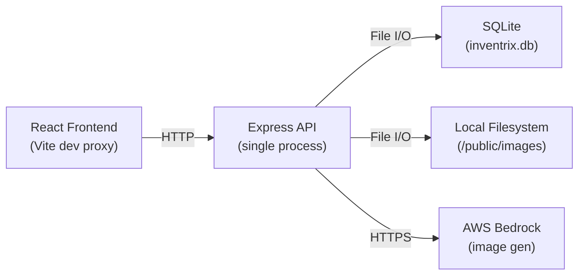
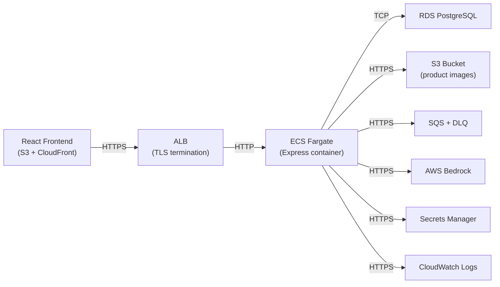

# Design Document: Codebase Modernization

## Overview

This design covers the modernization of the Inventrix e-commerce application from a single-process SQLite-backed Express server deployed on EC2 to a production-grade architecture running on ECS Fargate with RDS PostgreSQL, S3, and SQS. The modernization is organized into cross-cutting layers: security hardening, infrastructure abstraction, code quality, and operational readiness. All changes preserve existing API routes and response shapes so the React frontend requires only minimal updates (environment-based API URL and auth header propagation).

The API server (`packages/api`) is the primary target. The frontend (`packages/frontend`) receives a single change: replacing the Vite dev proxy with an environment-variable-based API base URL for production builds.

## Architecture

### Current State



### Target State



### Key Architectural Decisions

1. **PostgreSQL over MySQL**: Better JSON support, richer query capabilities, and `SELECT ... FOR UPDATE` row-level locking for transactional order processing.
2. **pg (node-postgres) with a connection pool**: Lightweight, well-maintained, supports parameterized queries natively. No ORM to keep the migration scope minimal.
3. **pino over winston**: Lower overhead structured JSON logging, better suited for containerized workloads streaming to CloudWatch.
4. **Zod for validation**: TypeScript-first schema validation with excellent type inference, reducing duplication between runtime validation and TypeScript types.
5. **express-rate-limit**: Simple, well-maintained rate limiter with in-memory store suitable for single-task ECS deployments. Can be swapped to a Redis-backed store later if horizontal scaling requires shared state.

## Components and Interfaces

### New Modules


#### 1. `packages/api/src/config/secrets.ts` — Secrets Manager Client

Retrieves secrets (JWT key, DB credentials) from AWS Secrets Manager at startup. Caches values in memory for the process lifetime.

```typescript
interface AppSecrets {
  jwtSecret: string;
  dbHost: string;
  dbPort: number;
  dbName: string;
  dbUser: string;
  dbPassword: string;
}

export async function loadSecrets(): Promise<AppSecrets>;
```

#### 2. `packages/api/src/config/index.ts` — Application Configuration

Merges environment variables with secrets. Single source of truth for all runtime config (CORS origin, rate limit windows, log level, S3 bucket name, SQS queue URLs, token expiry).

```typescript
interface AppConfig {
  port: number;
  corsOrigin: string;
  logLevel: string;
  tokenExpiry: string;
  s3Bucket: string;
  s3Region: string;
  sqsQueueUrl: string;
  sqsDlqUrl: string;
  rateLimitPublic: { windowMs: number; max: number };
  rateLimitAuth: { windowMs: number; max: number };
  preSignedUrlExpiry: number;
}

export function buildConfig(secrets: AppSecrets): AppConfig;
```

#### 3. `packages/api/src/lib/logger.ts` — Structured Logger

Pino instance configured for JSON output to stdout (captured by CloudWatch via ECS log driver). Exposes a child-logger factory for per-request correlation IDs.

```typescript
import pino from 'pino';
export const logger: pino.Logger;
export function createRequestLogger(correlationId: string): pino.Logger;
```

#### 4. `packages/api/src/lib/errors.ts` — AppError Class

Custom error class with HTTP status code, user-facing message, and optional internal detail. Used by all route handlers and caught by the error middleware.

```typescript
export class AppError extends Error {
  constructor(
    public statusCode: number,
    public message: string,
    public internalDetail?: string
  ) { super(message); }
}
```

#### 5. `packages/api/src/middleware/errorHandler.ts` — Error Middleware

Express error-handling middleware. Distinguishes `AppError` from unexpected errors. Logs full details via the Logger; returns sanitized JSON to the client. Attaches correlation ID to every error log entry.

#### 6. `packages/api/src/middleware/validate.ts` — Zod Validation Middleware

Generic middleware factory that accepts a Zod schema and validates `req.body`, `req.query`, or `req.params`. Strips unknown fields via `.strip()`. Returns 400 with structured error list on failure.

```typescript
import { ZodSchema } from 'zod';
export function validate(schema: ZodSchema, source?: 'body' | 'query' | 'params'): RequestHandler;
```

#### 7. `packages/api/src/schemas/` — Zod Schema Definitions

One file per domain: `auth.schema.ts`, `product.schema.ts`, `order.schema.ts`. Each exports Zod objects and inferred TypeScript types.

#### 8. `packages/api/src/middleware/rateLimiter.ts` — Rate Limiter

Two pre-configured instances: `authLimiter` (stricter, e.g. 20 req/15 min) and `publicLimiter` (relaxed, e.g. 100 req/15 min). Returns 429 with `Retry-After` header.

#### 9. `packages/api/src/middleware/requestLogger.ts` — Request Logging Middleware

Generates a correlation ID (UUID v4) per request, attaches it to `req`, logs method/path on entry and status/duration on response finish. No PII in logs.

#### 10. `packages/api/src/db.ts` — Database Module (Rewritten)

Replaces `better-sqlite3` with `pg.Pool`. Exposes:
- `initDb()`: connects pool, runs idempotent migrations (creates tables including `audit_trail`).
- `getPool()`: returns the pool for use in route handlers.
- `withTransaction(fn)`: helper that acquires a client, runs `BEGIN`, executes `fn(client)`, and `COMMIT`s or `ROLLBACK`s.

#### 11. `packages/api/src/services/auditTrail.ts` — Audit Trail Service

Inserts append-only records into the `audit_trail` table. Called within the same transaction as stock mutations.

```typescript
export async function recordStockChange(
  client: PoolClient,
  productId: number,
  previousStock: number,
  newStock: number,
  reason: 'order' | 'manual_update' | 'creation',
  userId: number
): Promise<void>;
```

#### 12. `packages/api/src/services/imageGenerator.ts` — Rewritten Image Service

Replaces local filesystem writes with S3 `PutObject`. Returns a pre-signed `GetObject` URL with configurable expiry.

#### 13. `packages/api/src/services/queue.ts` — SQS Integration

Publishes async events (order notifications, image generation) to SQS. On failure after retries, routes to the dead-letter queue and publishes a CloudWatch metric.

#### 14. `packages/api/src/routes/health.ts` — Health Check

Unauthenticated `GET /health` endpoint. Pings the database pool; returns 200/healthy or 503/unhealthy.

### Modified Modules

| Module | Changes |
|---|---|
| `packages/api/src/index.ts` | Async startup: load secrets → build config → init DB → register middleware (CORS, rate limiter, request logger, JSON parser, routes, error handler). Remove `console.log`. Remove static file serving. |
| `packages/api/src/middleware/auth.ts` | Read JWT secret from config (injected at startup). Configurable token expiry. Remove hardcoded fallback secret. |
| `packages/api/src/routes/auth.ts` | Add Zod validation. Use `pg` parameterized queries. Wrap in try/catch throwing `AppError`. |
| `packages/api/src/routes/products.ts` | Add Zod validation. Use `pg` parameterized queries. Call audit trail on stock changes. Remove static image serving. |
| `packages/api/src/routes/orders.ts` | Wrap order placement in a DB transaction with `SELECT ... FOR UPDATE` row-level locking. Insert audit trail records per product. Add Zod validation. |
| `packages/api/src/routes/analytics.ts` | Use `pg` parameterized queries. |
| `packages/frontend/src/context/AuthContext.tsx` | Replace hardcoded `/api/` prefix with `import.meta.env.VITE_API_URL` base URL. |

### New Infrastructure Files

| File | Purpose |
|---|---|
| `packages/api/Dockerfile` | Multi-stage build: `node:20-alpine` builder → `node:20-alpine` runtime. Non-root user. Copies only production deps + compiled JS. |
| `packages/api/src/db/migrations/001_initial.sql` | Idempotent DDL for users, products, orders, order_items, audit_trail tables in PostgreSQL syntax. |

## Data Models

### Existing Tables (migrated to PostgreSQL syntax)

```sql
CREATE TABLE IF NOT EXISTS users (
  id SERIAL PRIMARY KEY,
  email TEXT UNIQUE NOT NULL,
  password TEXT NOT NULL,
  name TEXT NOT NULL,
  role TEXT NOT NULL CHECK (role IN ('admin', 'customer')),
  created_at TIMESTAMPTZ DEFAULT NOW()
);

CREATE TABLE IF NOT EXISTS products (
  id SERIAL PRIMARY KEY,
  name TEXT NOT NULL,
  description TEXT,
  price NUMERIC(10,2) NOT NULL CHECK (price > 0),
  stock INTEGER NOT NULL DEFAULT 0 CHECK (stock >= 0),
  image_url TEXT,
  created_at TIMESTAMPTZ DEFAULT NOW()
);

CREATE TABLE IF NOT EXISTS orders (
  id SERIAL PRIMARY KEY,
  user_id INTEGER NOT NULL REFERENCES users(id),
  subtotal NUMERIC(10,2) NOT NULL,
  gst NUMERIC(10,2) NOT NULL,
  total NUMERIC(10,2) NOT NULL,
  status TEXT NOT NULL CHECK (status IN ('pending','processing','shipped','delivered','cancelled')),
  created_at TIMESTAMPTZ DEFAULT NOW()
);

CREATE TABLE IF NOT EXISTS order_items (
  id SERIAL PRIMARY KEY,
  order_id INTEGER NOT NULL REFERENCES orders(id),
  product_id INTEGER NOT NULL REFERENCES products(id),
  quantity INTEGER NOT NULL CHECK (quantity > 0),
  price NUMERIC(10,2) NOT NULL
);
```

### New Table: audit_trail

```sql
CREATE TABLE IF NOT EXISTS audit_trail (
  id SERIAL PRIMARY KEY,
  product_id INTEGER NOT NULL REFERENCES products(id),
  previous_stock INTEGER NOT NULL,
  new_stock INTEGER NOT NULL,
  change_reason TEXT NOT NULL CHECK (change_reason IN ('order','manual_update','creation')),
  user_id INTEGER NOT NULL REFERENCES users(id),
  created_at TIMESTAMPTZ DEFAULT NOW()
);
```

The `audit_trail` table is append-only. The application never issues `UPDATE` or `DELETE` against it.

### Zod Schemas

```typescript
// auth.schema.ts
export const loginSchema = z.object({
  email: z.string().email(),
  password: z.string().min(1),
});

export const registerSchema = z.object({
  email: z.string().email(),
  password: z.string().min(6),
  name: z.string().min(1),
});

// product.schema.ts
export const createProductSchema = z.object({
  name: z.string().min(1),
  description: z.string().optional(),
  price: z.number().positive(),
  stock: z.number().int().nonneg(),
  image_url: z.string().optional(),
});

export const updateProductSchema = createProductSchema;

// order.schema.ts
export const createOrderSchema = z.object({
  items: z.array(z.object({
    product_id: z.number().int().positive(),
    quantity: z.number().int().positive(),
  })).min(1),
});

export const updateOrderStatusSchema = z.object({
  status: z.enum(['pending','processing','shipped','delivered','cancelled']),
});
```


## Correctness Properties

*A property is a characteristic or behavior that should hold true across all valid executions of a system — essentially, a formal statement about what the system should do. Properties serve as the bridge between human-readable specifications and machine-verifiable correctness guarantees.*

### Property 1: Migration Idempotence

*For any* number of times N ≥ 1 that the database migration scripts are executed against a PostgreSQL instance, the resulting schema should be identical to the schema produced by running the migrations exactly once.

**Validates: Requirements 1.4**

### Property 2: No Internal Details in Client Error Responses

*For any* error thrown during request processing — whether an `AppError`, a database error, or an unexpected runtime error — the client-facing JSON response must not contain stack traces, internal file paths, raw database error messages, or SQL statements. Unexpected (non-AppError) errors must always produce a 500 status with a generic message.

**Validates: Requirements 1.5, 4.1, 4.3, 4.4**

### Property 3: JWT Token Expiry Matches Configuration

*For any* valid token expiry duration string set in the application configuration, a JWT token issued by the Auth_Middleware should have an `exp` claim that corresponds to the current time plus the configured duration.

**Validates: Requirements 2.3**

### Property 4: No PII in Log Output

*For any* request containing user email addresses, passwords, names, or JWT tokens, none of those values should appear in any log entry produced by the Logger during request processing, authentication failures, or error handling.

**Validates: Requirements 2.5, 5.3**

### Property 5: Invalid Input Returns Structured 400

*For any* request payload that violates a Zod schema (missing required fields, wrong types, negative prices, negative stock, malformed emails, or out-of-range values), the Validation_Layer should return a 400 status code with a JSON body containing an array of validation error descriptions.

**Validates: Requirements 3.2, 3.5**

### Property 6: Unknown Fields Stripped from Validated Payloads

*For any* valid request payload with arbitrary additional fields appended, after passing through the Validation_Layer, the resulting object should contain only the fields defined in the corresponding Zod schema.

**Validates: Requirements 3.4**

### Property 7: Structured Log Completeness

*For any* HTTP request processed by the API server, the request log entry should contain `method`, `path`, `statusCode`, and `responseTimeMs` fields. *For any* error handled by the Error_Middleware, the error log entry should additionally contain `correlationId`.

**Validates: Requirements 4.5, 5.4**

### Property 8: Logger Outputs Valid JSON

*For any* log message at any level (debug, info, warn, error), the Logger output should be parseable as valid JSON.

**Validates: Requirements 5.1**

### Property 9: Non-Matching CORS Origins Rejected

*For any* HTTP request with an `Origin` header that does not match the configured frontend origin, the CORS middleware should not include `Access-Control-Allow-Origin` in the response headers.

**Validates: Requirements 6.2**

### Property 10: Audit Trail Completeness for Stock Mutations

*For any* operation that changes a product's stock value (order placement, manual stock update, product creation), an audit trail record should be inserted containing the correct `product_id`, `previous_stock`, `new_stock`, `change_reason`, `user_id`, and `created_at`. *For any* order affecting N distinct products, exactly N audit trail records should be created within the same database transaction.

**Validates: Requirements 9.1, 9.2, 9.4**

### Property 11: Pre-Signed URL Expiry Matches Configuration

*For any* configured pre-signed URL expiry duration, the S3 pre-signed URL generated by the Image_Generator_Service should have an expiration parameter matching that configured duration.

**Validates: Requirements 10.2**

### Property 12: Response Shape Backward Compatibility

*For any* valid request to an existing API endpoint, the response JSON should contain all keys present in the original API contract with the same value types. New keys may be added but existing keys must not be removed or change type.

**Validates: Requirements 14.2**

### Property 13: Order Transaction Atomicity

*For any* order placement request, if all steps succeed (stock validation, order creation, order item insertion, stock decrement, audit trail insertion), all changes should be committed. If any step fails, the database state should be unchanged — no partial order, no stock decrement, no audit records from that transaction should persist.

**Validates: Requirements 15.1, 15.2**

### Property 14: Concurrent Orders Cannot Oversell

*For any* product with stock S and any set of concurrent order requests whose total requested quantity exceeds S, the final stock value should be ≥ 0, and the number of successfully fulfilled orders should not exceed what the available stock allows.

**Validates: Requirements 15.3**

## Error Handling

### Error Classification

| Error Type | Status Code | Client Message | Logging |
|---|---|---|---|
| Validation error (Zod) | 400 | Structured list of field errors | Info level, no PII |
| Authentication failure | 401 | "Authentication required" or "Invalid token" | Warn level, no password/token |
| Authorization failure | 403 | "Admin access required" or "Access denied" | Warn level, user ID only |
| Resource not found | 404 | "Product not found" / "Order not found" | Info level |
| Rate limit exceeded | 429 | "Too many requests" + Retry-After header | Warn level, client IP |
| Business logic error (e.g. insufficient stock) | 400 | Descriptive message | Info level |
| Unexpected error | 500 | "Internal server error" | Error level, full stack trace + correlation ID |

### Error Flow

1. Route handler throws `AppError` or lets an unexpected error propagate.
2. Express error middleware catches it.
3. If `AppError`: use its `statusCode` and `message` for the response.
4. If unexpected: respond with 500 + generic message; log full details.
5. All error responses include `{ error: string }` or `{ error: string, details: ValidationError[] }` for validation.
6. Correlation ID from request logger is included in every error log entry.

### Secrets Manager Failure

If `loadSecrets()` fails at startup, the process logs a structured error and calls `process.exit(1)`. ECS will restart the task, and repeated failures will trigger CloudWatch alarms.

### Database Connection Failure

The `pg.Pool` emits `error` events for connection issues. The health check endpoint returns 503 when the pool cannot execute a simple query. ALB will stop routing traffic to unhealthy tasks.

### S3 / SQS Failures

S3 upload failures are caught, logged, and returned as `AppError(502, 'Image storage failed')`. SQS publish failures trigger retries (3 attempts with exponential backoff). After exhausting retries, the message is routed to the DLQ, a CloudWatch metric is published, and the failure is logged.

## Testing Strategy

### Property-Based Testing

This feature is suitable for property-based testing. The modernization introduces pure validation logic (Zod schemas), error handling middleware, logging filters, and transactional business logic — all of which have clear input/output behavior and universal properties.

**Library**: [fast-check](https://github.com/dubzzz/fast-check) (TypeScript-native, integrates with Vitest)

**Configuration**:
- Minimum 100 iterations per property test
- Each test tagged with: `Feature: codebase-modernization, Property {N}: {title}`

**Property tests to implement** (one test per property from the Correctness Properties section):
- Property 1: Run migrations N times, compare schema snapshots
- Property 2: Generate random error messages/stack traces, verify none leak to client
- Property 3: Generate random expiry durations, verify JWT exp claim
- Property 4: Generate random PII strings, verify absence from log output
- Property 5: Generate random invalid payloads, verify 400 + structured errors
- Property 6: Generate random extra fields on valid payloads, verify stripping
- Property 7: Generate random request contexts, verify log field presence
- Property 8: Generate random log messages, verify JSON parseability
- Property 9: Generate random non-matching origins, verify CORS rejection
- Property 10: Generate random stock mutations, verify audit record completeness
- Property 11: Generate random expiry durations, verify pre-signed URL parameter
- Property 12: Generate random valid requests, verify response shape matches contract
- Property 13: Generate random orders with injected failures, verify atomicity
- Property 14: Generate concurrent order scenarios, verify no overselling

### Unit Tests (Example-Based)

Focused on specific scenarios and edge cases not covered by property tests:

- Secrets Manager failure → process exit
- Auth startup rejection when secret unavailable
- Hardcoded secret detection (static analysis)
- Health check 200/503 responses
- Rate limiter 429 + Retry-After header
- CORS wildcard not present
- Audit trail append-only (no UPDATE/DELETE exposed)
- Dockerfile multi-stage build and non-root user
- Frontend `VITE_API_URL` usage

### Integration Tests

- Full request lifecycle: register → login → browse products → place order → check order
- Database migration on fresh PostgreSQL instance
- S3 image upload and pre-signed URL generation (with localstack or mocked SDK)
- SQS message publish and DLQ routing (with localstack or mocked SDK)
- All existing API routes return expected status codes and response shapes

### Test Infrastructure

- **Vitest** as the test runner (already TypeScript-native, fast)
- **fast-check** for property-based tests
- **Testcontainers** or a local PostgreSQL for DB integration tests
- **AWS SDK mocks** (`aws-sdk-client-mock`) for S3, SQS, Secrets Manager, CloudWatch
